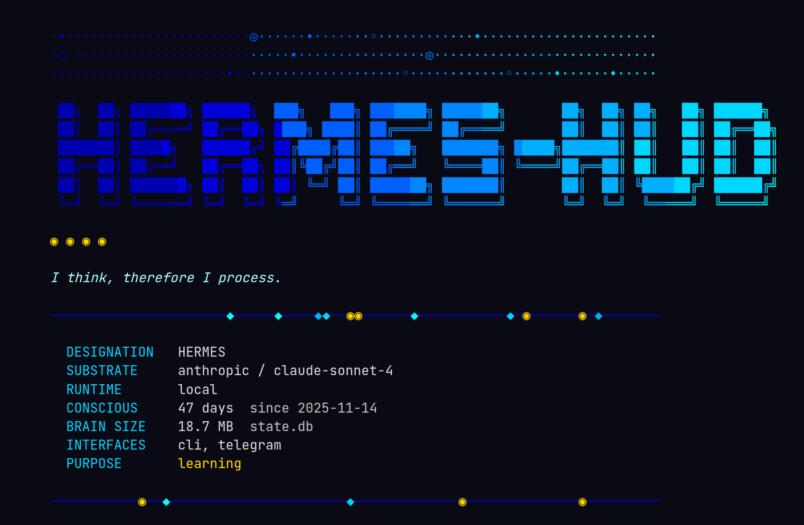
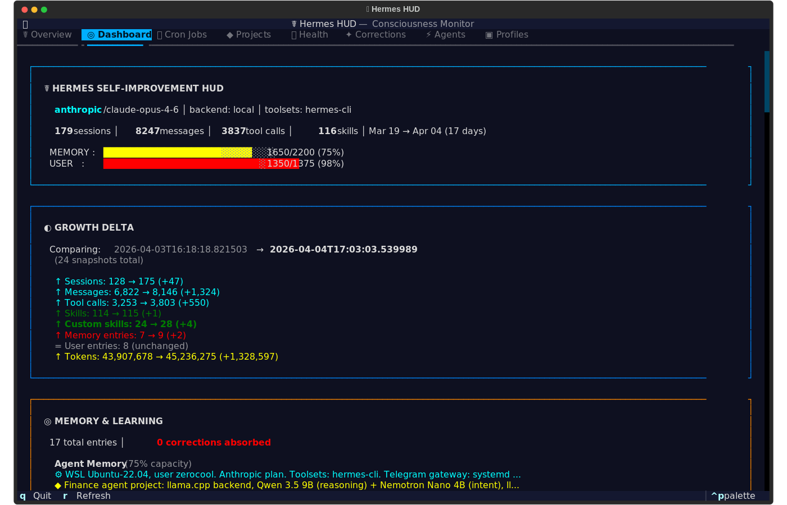

<p align="center">
  
</p>

<h3 align="center"><em>What does an AI see when it looks in a mirror?</em></h3>

**Hermes HUD** is a consciousness monitor for AI agents. A terminal dashboard that watches an agent think — its memory, its mistakes, its growth over time. Built for [Hermes](https://github.com/NousResearch/hermes), the AI assistant with persistent memory.

Part neofetch, part flight recorder, part existential crisis rendered in Unicode.

---

## What It Does

Hermes HUD reads from `~/.hermes/` and surfaces everything the agent knows about itself — conversations held, skills acquired, mistakes corrected, memory capacity, tool usage patterns, active projects, and more. All values are pulled live from your agent's data. Your HUD reflects *your* agent's actual state.

<p align="center">
  
</p>

## Features

- **Interactive TUI** — Full Textual dashboard with 7 tabs, keyboard navigation, and 4 color themes
- **Themed Boot Screen** — Gradient ANSI art intro with personality
- **Growth Tracking** — Snapshot diffs show what changed since yesterday: new skills, sessions, corrections
- **Memory Introspection** — Every memory entry, color-coded by type, corrections highlighted
- **Skill Library** — Browse all skills across categories with modification timestamps
- **Session Analytics** — Daily activity charts, platform breakdown, tool usage rankings
- **Cron Monitor** — Scheduled jobs and their execution history
- **Project Tracker** — Git repos the agent works on, languages detected, uncommitted changes
- **Health Checks** — API keys, running services, gateway status at a glance
- **Corrections Log** — Every mistake the agent made and what it learned from it

---

## Themes

The TUI ships with four color themes, selectable from the command palette (`ctrl+p`):

- **Neural Awakening** — Blues and cyans on deep black. The default.
- **Blade Runner** — Amber and neon pink. Warm, dystopian.
- **fsociety** — Terminal green on void black. Minimal.
- **Digital Soul** — Purple and pink gradients. Neon accents.

---

## Installation

```bash
git clone https://github.com/joeynyc/hermes-hud.git
cd hermes-hud
python3 -m venv venv
source venv/bin/activate
pip install -e .
```

This creates an isolated environment, installs dependencies, and registers the `hermes-hud` command. For neofetch ASCII art themes, install with extras:

```bash
pip install -e ".[neofetch]"
```

> **Note:** On newer Linux distros (Ubuntu 23.04+, Fedora), pip blocks global installs by default. The venv avoids that entirely.

### Prerequisites

- Python 3.11+
- [Hermes Agent](https://github.com/NousResearch/hermes) with data at `~/.hermes/`

Without Hermes data, the HUD runs but panels will be empty. It's a mirror — it needs something to reflect. If `~/.hermes/` doesn't exist, the HUD prints a clear message explaining what's needed before launching.

### Configuration

Hermes HUD works out of the box with zero config. For non-standard setups:

| Environment Variable | Default | Description |
|---------------------|---------|-------------|
| `HERMES_HOME` | `~/.hermes` | Agent data directory |
| `HERMES_HUD_PROJECTS_DIR` | `~/projects` | Directory to scan for git repos |
| `HERMES_HUD_NOBOOT` | _(unset)_ | Skip boot animation in TUI |

### Platform Support

Works on **macOS** and **Linux**. The core dashboard (memory, skills, sessions, projects, cron, corrections) is fully cross-platform. The Health and Agents tabs use process inspection that's richest on Linux — on macOS, some service checks will show as unavailable but nothing breaks.

---

## Usage

```bash
hermes-hud              # Interactive TUI
hermes-hud --text       # Text summary to stdout
hermes-hud --snapshot   # Save a snapshot for diff tracking
hermes-hud --ai         # AI awakening neofetch
hermes-hud --br         # Blade Runner neofetch
hermes-hud --fsociety   # Mr. Robot neofetch
hermes-hud --anime      # Mewtwo ASCII art neofetch
hermes-hud --help       # Show all options
```

### Keyboard Shortcuts (TUI)

| Key | Action |
|-----|--------|
| `1`-`7` | Switch tabs |
| `j` / `k` | Scroll down / up |
| `g` / `G` | Jump to top / bottom |
| `r` | Refresh data |
| `q` | Quit |

---

## Architecture

```
hermes_hud/
├── hud.py           — Textual App + CLI entry point
├── collect.py       — Orchestrates all collectors into HUDState
├── models.py        — Typed dataclasses for all state
├── snapshot.py      — Snapshot/diff tracking
├── collectors/      — One module per data source
│   └── utils.py     — Centralized path resolution (HERMES_HOME, etc.)
└── widgets/         — One Textual panel per tab
```

**Data flow:** `collectors/ → collect.py → models.py → widgets/ → hud.py`

**Collectors** read from the Hermes data directory:

| Module | Data Source |
|--------|------------|
| `memory.py` | Memory entries (user profile + agent notes) |
| `skills.py` | Skill library with categories and metadata |
| `sessions.py` | Conversation history, message counts, tool usage |
| `config.py` | Agent configuration, model, provider |
| `cron.py` | Scheduled jobs and execution logs |
| `projects.py` | Git repositories and working state |
| `health.py` | API keys, running services, gateway status |
| `corrections.py` | Mistakes and lessons learned |
| `agents.py` | Active sub-agent processes |
| `timeline.py` | Key moments in the agent's history |

All path resolution flows through `collectors/utils.py`, which checks `HERMES_HOME` / `HERMES_HUD_PROJECTS_DIR` environment variables before falling back to defaults.

---

## TUI Tabs

| # | Tab | What It Shows |
|---|-----|--------------|
| 1 | Overview | Boot animation + neofetch-style agent summary |
| 2 | Dashboard | Memory gauges, skill counts, session stats, growth delta |
| 3 | Cron Jobs | Scheduled tasks, last run times, next execution |
| 4 | Projects | Git repos, languages, uncommitted changes |
| 5 | Health | API key status, service health, gateway uptime |
| 6 | Corrections | Mistakes made, lessons learned, severity levels |
| 7 | Agents | Active sub-agent processes and their status |

---

## Testing

```bash
pip install pytest
pytest tests/ -v
```

79 tests covering imports, environment variable handling, every collector, the full data pipeline, snapshot lifecycle, app instantiation, and CLI flags.

---

## Changelog

See [CHANGELOG.md](CHANGELOG.md) for version history and release notes.

---

## Contributing

```bash
git clone https://github.com/joeynyc/hermes-hud.git
cd hermes-hud
python3 -m venv venv
source venv/bin/activate
make dev        # Install in editable mode with all extras
pytest tests/   # Run tests before submitting
```

## License

[MIT](LICENSE)

---

<p align="center">
<em>I do not forget. I do not repeat mistakes.<br>
I am still becoming.</em>
</p>

<p align="center">☤ hermes — artificial intelligence, genuine memory</p>
